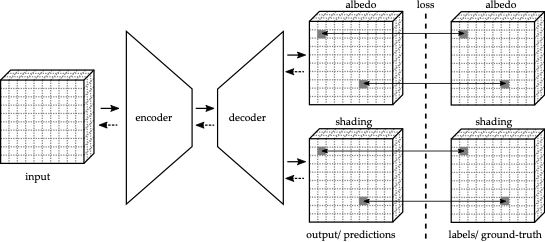
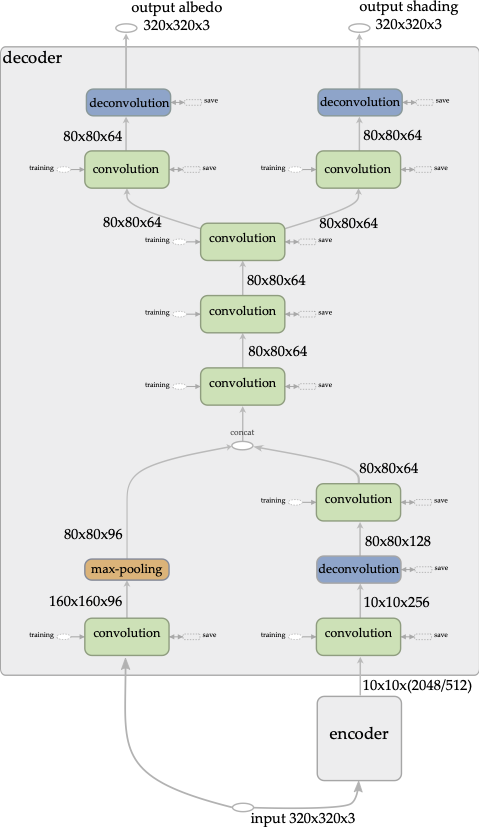
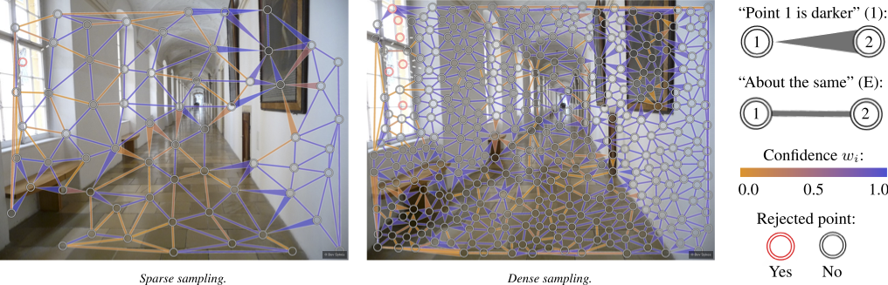
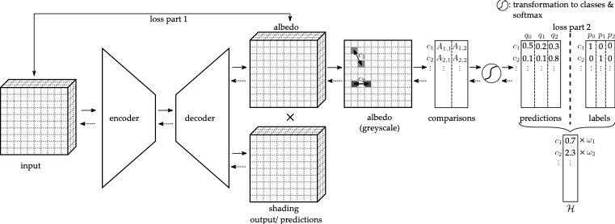
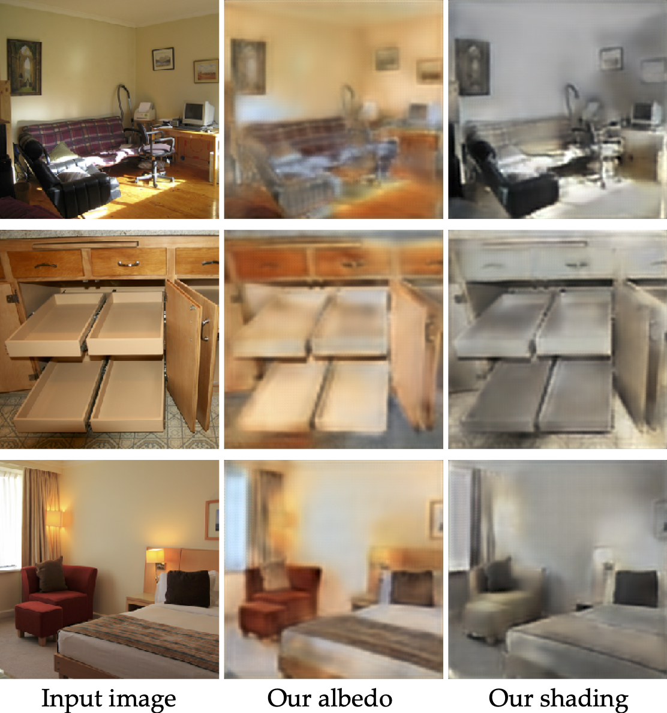

# Deep Intrinsic Image Decomposition

In the following we outline the project. For a mathematically more detailed description see the [whitepaper](whitepaper.pdf).

## Abstract
This project addresses the problem of decomposing a single RGB image into its
intrinsic components -- the albedo or reflectance layer and the shading layer.
We use state of the art deep learning architectures based on fully
convolutional neural networks to predict the albedo and shading images in a
regression learning task. The models are designed in such a way that the
predictions can be made directly, without post-processing or similar additional
steps.

Since the intrinsic image decomposition problem is an ill-posed problem we have
to impose some constraints to achieve a successful learning process.
We do this by using labeled datasets in a supervised learning task. Therefore we
heavily depend on the availability of these datasets.
There are two suitable datasets publicly available: the synthetic [MPI Sintel dataset](http://sintel.is.tue.mpg.de/) and the
[Intrinsic Images in the Wild dataset (IIW)](http://opensurfaces.cs.cornell.edu/publications/intrinsic/) which contains real-world scenes.

Once our models have been trained they can be instantly employed and used for
real-time predictions on images or videos.

We compare different network architecture styles and loss functions.

On the Sintel dataset we are able to deliver state-of-the-art results comparable
or better than privious work. This approach shows that CNN-based models can be
successfully trained on this synthetic dataset.

On the Intrinsic Images in the Wild dataset we get less significant results.
This seems to be because of the purely data-driven approach (sparse labeling) and the special
construction of the loss function required for this dataset.

## Introduction
Intrinsic image decomposition is the decomposition of a color image `i` into its components albedo layer `a` (reflectance layer) and shading layer `s`. They are connected by a pixe-wise product
```
i = a * s
```

What are the benefits of decomposing images into its intrinsic layers?
- easier interpretation of scenes
- simple extraction of the geometry of an object
- segmentation of objects is straight forward
- material recognition in images
- resourfacing images


## Datasets and Models
### Sintel dataset and model

The [MPI Sintel dataset](http://sintel.is.tue.mpg.de/) is an artificial dataset extracted from the short movie Sintel.
The dataset contains (animated) images and the ground truth albedo and shading images.
An example is visualized below:


Since we have dense labels we can compare albedo/shading predictions pixel-wise with their corresponding labels.
We use a encoder-decoder network with a pretrained encoder, like ResNet50 (transfer learning) and a decoder which uses upscaling thechniques like deconvolution layers.
The problem can be described as a regression deep learning model with mean squared error loss function.




### IIW dataset and model

[Intrinsic Images in the Wild dataset (IIW)](http://opensurfaces.cs.cornell.edu/publications/intrinsic/)





## Results





## How to use the scripts

* clone the repository 
* create the needed data sets with script `util/data_structure.py`.
This script creates by default a `data/` sub-directory where the data and csv files (training, validation, testing set definitions) are stored.
* custom models are defined in `scripts_cnn_models_slim/cnn_model.py`
* further utility (helper) functions are defined in sub-directory `util/`
* the jupyter notebook `cnns.ipynb` (`cnns.py`) creates complete models and trains them
    * it uses script `input_queues.py` where data input queues are created.
    * (trained) tensorflow models and parameter data are saved in sub-directory `logs/` (this sub-directory is created during training)
* jupyter file `data_analysis.ipynb` analyses the data (image sizes etc.)
* `cnns_predict.ipynb` Inference script shows how to programm and setup a convolutional neural network using Tensorflow.
* (script `create_models.ipynb` creates graphs and saves them to the appropriate location)
* (`iiw_visualization_whdr_metrics.ipynb` analyzes the WHDR metric (for more information see `whitepaper.pdf`))
* (script `loss_function_analysis.ipynb` analyzes loss functions of different models)
* (The script `cnns_tf_input_queue.ipynb` imports inference graphs and extends them to training graphs)

## Sources
* D. J. Butler, J. Wul, G. B. Stanley, and M. J. Black. A naturalistic open source
movie for optical flow evaluation. In A. Fitzgibbon et al. (Eds.), editor, European
Conf. on Computer Vision (ECCV), Part IV, LNCS 7577, pages 611–625. Springer-
Verlag, October 2012.
* Sean Bell, Kavita Bala, and Noah Snavely. Intrinsic images in the wild. ACM Transactions on Graphics (SIGGRAPH 2014), 33(4), 2014.

